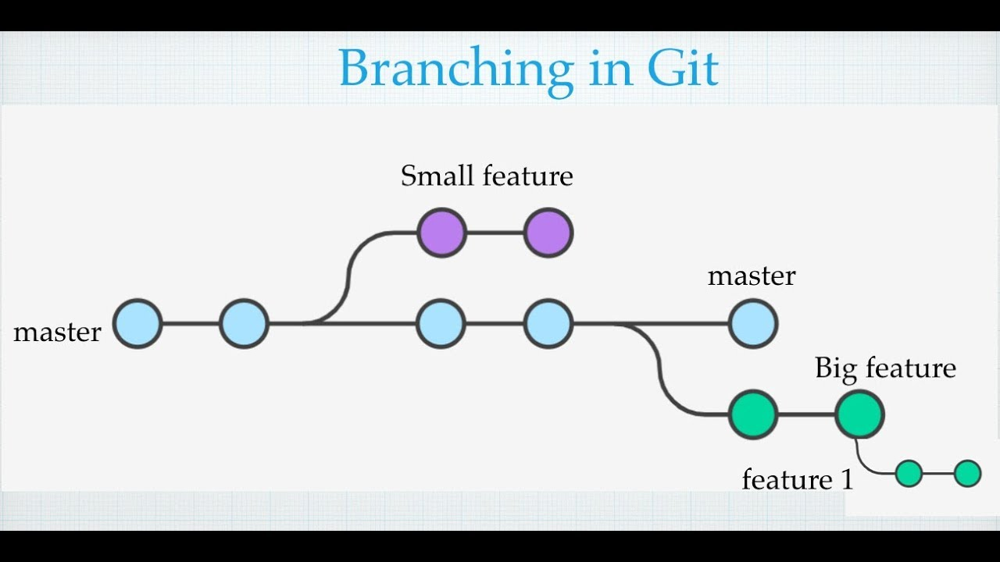

# Cours Git : Branches

## Objectif

Ce dépôt a pour but d'apprendre à manipuler Git, en particulier la gestion des branches.  
Nous explorerons les différentes commandes Git, leur utilisation et leur utilité.

Nous verrons aussi les opperateurs bash.

## Arboraissance

```bash
➜  Cours_git_branch git:(main) ✗ tree
.
├── README.md
├── add_commit_push.sh
├── img
│   └── ["image pour illustration"]
└── script
    ├── git
    │   └── ["script concernant les commande git"]
    └── les opperateur bash
        └── ["opperateur bash utilise dans le dossier git"]

3 directories, 8 files
```

## Explication des opperateur bash

explication des operrateur bash

### not equal

### zero

## Explication des commande git

explication de la commande git explique c'est quoi HEAD

nous verrons le focntionement des commande majortierment et dautre aussi optionelle :
- commit
- branch
- checkout
- cherry-pick
- reset
- revert
- rebase avec -i
- merge
### remmot

### add

### commit


## Outil

Les principaux outil pour manipuler les branchement et commit comme ceci



## Extension

Il existe une extensions git lens qui est tres performant mais que je trouve trop intimident 
et git graph qui a laire beaucoup plus simple de le prendre en main etpermet de visualise en graph

pour moi git graph fais le café alors que git lens et trop lourd.

## Apllication

Il y a sublime merge et fork qui laire detre pas mal etemp donné que mes camarade utilise sublime texte je vais donc teste sublime merge 
japrecie pas trop car pour une majorité il faut payet une lisence *

ya tig qui est vraiment pas mal si on aime code avec vim car cest sur le terminal et basique vraiment super
Jai teste sublime merge jaime pas car faut avoir une licens pour avoir le dark mode donc BON
tig tres sympa et aussi gitk qui est bien si on shoauite avoir des outils qui nous permet de visualise les branche commit etc